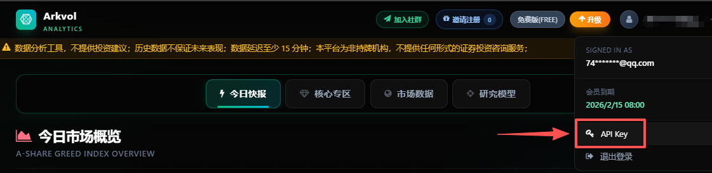

<div align="center">

# Arkvol Skill

**让 AI Agent 使用自然语言查询多市场聚合情绪数据**

[](LICENSE)
[](https://agentskills.io)
[](https://skills.sh)
[](#2-安装-skill)

[Arkvol.com](https://arkvol.com) · [安装](#2-安装-skill) · [更新](#3-更新) · [安全说明](#安全说明)
<p align="center">
  
  <br/>
</p>

</div>

## 简介

[arkvol.com](https://arkvol.com) 是覆盖 A 股、港股和美股的金融数据服务，通过市场情绪、贪婪与恐慌指数等聚合指标，帮助用户客观观察历史或当期市场状态。

Arkvol Skill 将 [arkvol.com](https://arkvol.com) 的数据查询能力接入兼容 Agent Skills 的 AI Agent。安装后，可以直接用自然语言查询 A 股与科技板块、港股、基金与 ETF、美股中期情绪及七巨头历史相对表现等数据。

当前源码版本见 [`VERSION`](VERSION)。

> 本 Skill 仅提供带有日期和来源的非个性化、描述性市场数据及指标定义，不提供荐股、买卖、仓位、目标价、收益预测或投资组合建议。

## 1. 获取 API Key

前往 [arkvol.com](https://arkvol.com) 注册或登录，从右上角头像进入 **API Key** 页面创建 Key。完整 Key 仅显示一次。



## 2. 安装 Skill

Arkvol Skill 基于开放的 [Agent Skills](https://agentskills.io) 协议，可在兼容 Agent Skills 的 AI Agent 中运行。

打开你正在使用的 Agent（如 Claude Code、Codex、Cursor、OpenClaw、WorkBuddy 等），告诉它：

```text
帮我安装这个 Skill：https://github.com/joutaojian/arkvol-skill，帮我配置 Arkvol Skill 的 API Key。我的 API Key 是：arkvol-sk-xxxxxxxxxxxxxxxxxxxxxxxxxxxxxxxx
```

## 3. 更新 Skill

需要更新时，告诉 AI Agent：
```text
帮我把 Arkvol Skill 升级到最新版本：https://github.com/joutaojian/arkvol-skill
```

## 安全说明

缺少 Key 时，脚本会提示前往 Arkvol 创建并写入配置文件。

- 不要要求或使用本 Skill 推荐、筛选、排名金融产品或生成交易信号。
- 仅在可信的本地或私有 Agent 会话中提供 Key，不要在 README、公开聊天、命令记录或日志中公开 Key。
- 包含 Key 的 Skill 不得分享或上传 GitHub。
- Key 泄露后，立即在 Arkvol 重新生成或禁用。
