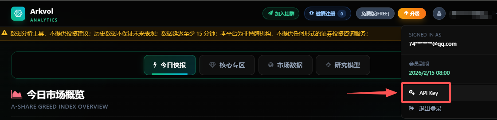

<div align="center">

[English](README.md) | **简体中文**

# Arkvol Skill

**让 AI Agent 使用自然语言查询并解读多市场金融数据**

[](LICENSE)
[](https://agentskills.io)
[](https://skills.sh)
[](#2-安装-skill)

[Arkvol.com](https://arkvol.com) · [安装](#2-安装-skill) · [更新](#3-更新-skill) · [安全说明](#安全说明)

<p align="center">
  
  <br/>
</p>

</div>

## 简介

[arkvol.com](https://arkvol.com) 是覆盖 A 股、港股和美股的金融数据分析服务，通过市场情绪、贪婪与恐慌指数、板块轮动等指标，帮助用户观察市场状态和趋势。

Arkvol Skill 将 [arkvol.com](https://arkvol.com) 的数据查询与解读能力接入兼容 Agent Skills 的 AI Agent。安装后，可以直接用自然语言查询 A 股与科技板块、港股、基金与 ETF、美股中期趋势、七巨头、全球资金流、中国国债温度和 52 周低位聚合统计，并获得包含数据日期、关键指标和风险边界的分析结果。

当前源码版本见 [`VERSION`](VERSION)。

## API Key Skill 参考实例

这是一个原生支持 API Key 配置的 Skill，已经过 100+ 用户的实践测试，可作为其他项目开发 API-key Skill 的参考实例。

可复用的设计包括：将用户密钥持久化在 Skill 仓库之外、支持命令行/配置文件/环境变量的明确优先级、支持自动化升级、使用示例配置而不提交真实密钥、统一鉴权错误处理，以及在回答和日志中避免输出完整 Key。其他项目的 Skill 可以直接借鉴这套配置与安全边界设计。

## 1. 获取 API Key

前往 [arkvol.com](https://arkvol.com) 注册或登录，从右上角头像进入 **API Key** 页面创建 Key。完整 Key 仅显示一次。



## 2. 安装 Skill

Arkvol Skill 基于开放的 [Agent Skills](https://agentskills.io) 协议，可在兼容 Agent Skills 的 AI Agent 中运行。

> 安装提示：本 Skill 仅提供市场数据与指标解读，不做荐股，不构成投资建议；投资决策及风险由用户自行承担。

打开你正在使用的 Agent（如 Claude Code、Codex、Cursor、OpenClaw、WorkBuddy 等），告诉它：

```text
帮我安装这个 Skill：https://github.com/joutaojian/arkvol-skill，帮我配置 Arkvol Skill 的 API Key。
我的 API Key 是：[替换成你的API Key]
```

安装完成后可直接询问：

```text
现在 A 股情绪怎么样？
全球资金流蛋糕当前是扩张还是收缩？
中国 30 年期国债温度是多少？
52 周低位模型当前有多少有效样本？
```

## 3. 更新 Skill

0.3.0 起，每次数据查询都会先向 Arkvol 检查最新 Skill 版本。也可以主动告诉 AI Agent：

> 更新提示：本 Skill 仅提供市场数据与指标解读，不做荐股，不构成投资建议；投资决策及风险由用户自行承担。

```text
帮我把 Arkvol Skill 升级到最新版本：https://github.com/joutaojian/arkvol-skill
```

## 安全说明

缺少 Key 时，脚本会提示前往 Arkvol 创建并写入配置文件。

- 不要要求或使用本 Skill 推荐、筛选、排名金融产品或生成交易信号。
- 仅在可信的本地或私有 Agent 会话中提供 Key，不要在 README、公开聊天、命令记录或日志中公开 Key。
- 包含 Key 的 Skill 不得分享或上传 GitHub。
- Key 泄露后，立即在 Arkvol 重新生成或禁用。
